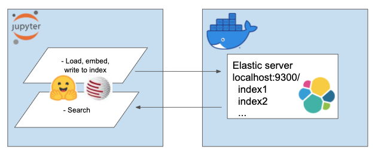

# ElasticTransformers
Semantic Elasticsearch with Sentence Transformers. We will use the power of Elastic and the magic of BERT to idnex a million articles and perform lexical and semantic search on them.  

The purpose is to provide an ease-of-use way of setting up your own Elasticsearch with near state of the art capabilities of contextual embeddings / semantic search using NLP transformers.  

## Overview
We will use the above to 
- Set up an Elasticsearch server with Dockers
- Collect A Million News Headlines
- Use sentence-transformers to index them onto Elastic (takes about 6 hrs on 2 CPU cores)
- Look at some comparison examples between lexical and semantic search

## Setup
### Set up your environment
My environment is called `et` and I use conda for this. Navigate inside the project directory
```
conda create --name et python=3.7  
conda install -n et nb_conda_kernels  
pip install -r requirements.txt
```

### Get the data
For this tutorial I am using [A Million News Headlines](https://www.kaggle.com/therohk/million-headlines "Kaggle A Million News Headlines") by Rohk and place it in the data folder inside the project dir.   

	    elastic_transformers/
	    ├── data/

You will find that the steps are otherwise pretty abstracted so you can also do this with your dataset of choice

### Elasticsearch with Docker
Follow the instructions on setting up Elastic with Docker from Elastic's page [here](https://www.elastic.co/guide/en/elasticsearch/reference/current/docker.html)
For this tutorial, you only need to run the two steps:
 - [Pulling the image](https://www.elastic.co/guide/en/elasticsearch/reference/current/docker.html#_pulling_the_image)
 - [Starting a single node cluster with Docker](https://www.elastic.co/guide/en/elasticsearch/reference/current/docker.html#docker-cli-run-dev-mode)

## Features

This is an overview of the system setup

<p align="center">
  
</p>

The repo introduces the ElasiticTransformers class. Utilities which help create, index and query Elasticsearch indices which include embeddings

```
# initiate the connection links as well as (optionally) the name of the index to work with
et=ElasticTransformers(url='http://localhost:9300',index_name='et-tiny')

# create_index_spec creates the specification for the index. Lists of relevant fields can 
# be provided based on whether those would be needed for keyword search or semantic 
# (dense vector) search. It also has parameters for the size of the dense vector as those can vary
et.create_index_spec(
    text_fields=['publish_date','headline_text'],
    dense_fields=['headline_text_embedding'],
    dense_fields_dim=768
)
# create_index - uses the spec created earlier to create an index ready for search
et.create_index()
# write_large_csv - breaks up a large csv file into chunks and iteratively uses a predefined 
# embedding utility to create the embeddings list for each chunk and subsequently feed results to the index
et.write_large_csv('data/tiny_sample.csv',
                  chunksize=1000,
                  embedder=embed_wrapper,
                  field_to_embed='headline_text')
# search - allows to select either keyword (‘match’ in Elastic) or semantic (dense in Elastic) 
# search. Notably it requires the same embedding function used in write_large_csv
et.search(query='search these terms',field='headline_text',type='match',embedder=embed_wrapper, size = 1000)
```

## Usage
After successful setup, use the folling notebooks to make this all work  
- [Setting up the index](../master/notebooks/Setting_up_ElasticTransformers.ipynb)
- [Searching](../master/notebooks/Searching_with_ElasticTransformers.ipynb)

## References
This repo combines together the following amazing works by brilliant people. Please check out their work if you haven't done so yet...

### The ML part
- [sentence-transformers](https://github.com/UKPLab/sentence-transformers)  
- [transformers](https://github.com/huggingface/transformers)  
- [BERT](https://github.com/google-research/bert)
### The engineering part
- [Elasticsearch](https://www.elastic.co/home)  
- [Docker](https://hub.docker.com)
